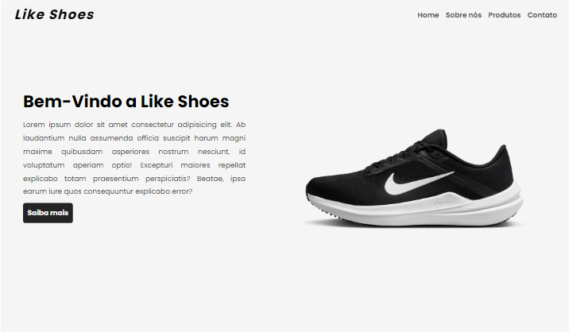

# Landing Page da Loja de Sapatos "Like Shoes"

Bem-vindo ao projeto da Landing Page para a loja virtual de sapatos "Like Shoes"! Este projeto foi desenvolvido utilizando HTML, CSS e JavaScript para criar uma experiência de usuário atraente e funcional.

<h1 align="center">
    
</h1>

## Sobre o Projeto

A Landing Page da "Like Shoes" foi criada com o objetivo de atrair clientes em potencial para a loja virtual de sapatos, fornecendo uma visão geral dos produtos oferecidos, informações sobre a empresa e uma forma fácil de entrar em contato.

## Funcionalidades

- **Apresentação de Produtos**: Exibição de uma seleção de produtos em destaque, com imagens atraentes e informações básicas sobre cada produto.
- **Seção "Sobre Nós"**: Informações sobre a empresa, destacando valores e diferenciais.
- **Menu de Navegação**: Navegação intuitiva por meio do menu de navegação no cabeçalho da página.
- **Responsividade**: O design da página é responsivo, garantindo uma experiência de usuário consistente em diferentes dispositivos, desde desktops até smartphones.
- **Menu Hamburguer para Dispositivos Móveis**: Menu hamburguer para facilitar a navegação em dispositivos móveis.

## Tecnologias Utilizadas

- **HTML**: Utilizado para estruturar o conteúdo da página.
- **CSS**: Responsável pela estilização e layout da página, garantindo uma apresentação visualmente atraente.
- **JavaScript**: Implementação de funcionalidades interativas, como animação de scroll e menu hamburguer.

## Autor

Este projeto foi desenvolvido por [João Guilherme](https://github.com/JGuiDev).